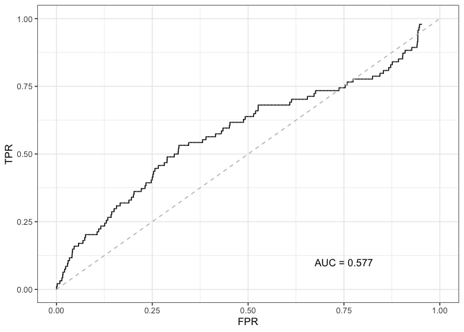
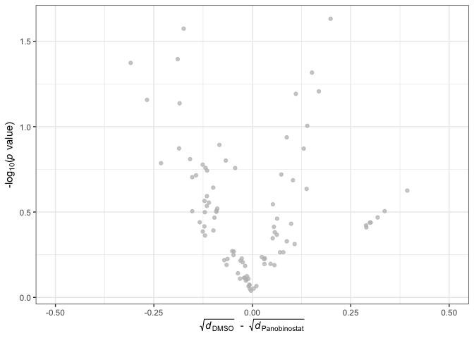
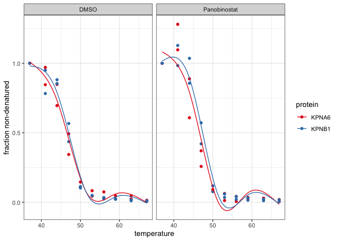

<!-- README.md is generated from README.Rmd. Please edit that file -->
Rtpca
=====

<!-- badges: start -->
[](https://travis-ci.org/nkurzaw/Rtpca) [](https://codecov.io/gh/nkurzaw/Rtpca) <!-- badges: end -->

> Differential thermal co-aggregation analysis of TPP datasets using R

Installation
============

Installation from *Bioconductor*

``` r
if (!requireNamespace("BiocManager", quietly = TRUE))
    install.packages("BiocManager")
BiocManager::install("Rtpca")
```

1.  Load the package into your R session.

``` r
library(Rtpca)
#> Loading required package: Biobase
#> Loading required package: BiocGenerics
#> Loading required package: parallel
#> 
#> Attaching package: 'BiocGenerics'
#> The following objects are masked from 'package:parallel':
#> 
#>     clusterApply, clusterApplyLB, clusterCall, clusterEvalQ,
#>     clusterExport, clusterMap, parApply, parCapply, parLapply,
#>     parLapplyLB, parRapply, parSapply, parSapplyLB
#> The following objects are masked from 'package:stats':
#> 
#>     IQR, mad, sd, var, xtabs
#> The following objects are masked from 'package:base':
#> 
#>     anyDuplicated, append, as.data.frame, basename, cbind, colnames,
#>     dirname, do.call, duplicated, eval, evalq, Filter, Find, get, grep,
#>     grepl, intersect, is.unsorted, lapply, Map, mapply, match, mget,
#>     order, paste, pmax, pmax.int, pmin, pmin.int, Position, rank,
#>     rbind, Reduce, rownames, sapply, setdiff, sort, table, tapply,
#>     union, unique, unsplit, which, which.max, which.min
#> Welcome to Bioconductor
#> 
#>     Vignettes contain introductory material; view with
#>     'browseVignettes()'. To cite Bioconductor, see
#>     'citation("Biobase")', and for packages 'citation("pkgname")'.
#> Loading required package: dplyr
#> 
#> Attaching package: 'dplyr'
#> The following object is masked from 'package:Biobase':
#> 
#>     combine
#> The following objects are masked from 'package:BiocGenerics':
#> 
#>     combine, intersect, setdiff, union
#> The following objects are masked from 'package:stats':
#> 
#>     filter, lag
#> The following objects are masked from 'package:base':
#> 
#>     intersect, setdiff, setequal, union
#> Loading required package: tidyr
```

Introduction
============

Thermal proteome profiling (TPP) (Savitski et al. 2014; Mateus et al. 2020) is a mass spectrometry-based, proteome-wide implemention of the cellular thermal shift assay (Molina et al. 2013). It was originally developed to study drug-(off-)target engagement. However, it was realized that profiles of interacting protein pairs appeared more similar than by chance which was coined as 'thermal proximity co-aggregation' (TPCA) (Tan et al. 2018). The R package `Rtpca` enables analysis of TPP datasets using the TPCA concept for studying protein-protein interactions and protein complexes and also allows to test for differential protein-protein interactions across different conditions.

This vignette only represents a minimal example. To have a look at a more realistic example feel free to check out [this more realistic example](https://github.com/nkurzaw/Rtpca_analysis/blob/master/Becher_et_al_reanalysis.pdf).

We also load the `TPP` package to illustrate how to import TPP data with the Bioconductor package and then input in into the `Rtpca` functions.

``` r
library(TPP)
#> Loading required package: magrittr
#> 
#> Attaching package: 'magrittr'
#> The following object is masked from 'package:tidyr':
#> 
#>     extract
```

Import Thermal proteome profiling data using the TPP package
------------------------------------------------------------

``` r
data("hdacTR_smallExample")
```

Filter hdacTR\_data to speed up computations

``` r
set.seed(123)
random_proteins <- sample(hdacTR_data[[1]]$gene_name, 300)
```

``` r
hdacTR_data_fil <- lapply(hdacTR_data, function(temp_df){
    filter(temp_df, gene_name %in% random_proteins)
})
```

We can now import our small example dataset using the import function from the `TPP` package:

``` r
trData <- tpptrImport(configTable = hdacTR_config, data = hdacTR_data_fil)
#> Importing data...
#> Comparisons will be performed between the following experiments:
#> Panobinostat_1_vs_Vehicle_1
#> Panobinostat_2_vs_Vehicle_2
#> 
#> The following valid label columns were detected:
#> 126, 127L, 127H, 128L, 128H, 129L, 129H, 130L, 130H, 131L.
#> 
#> Importing TR dataset: Vehicle_1
#> Removing duplicate identifiers using quality column 'qupm'...
#> 300 out of 300 rows kept for further analysis.
#>   -> Vehicle_1 contains 300 proteins.
#>   -> 299 out of 300 proteins (99.67%) suitable for curve fit (criterion: > 2 valid fold changes per protein).
#> 
#> Importing TR dataset: Vehicle_2
#> Removing duplicate identifiers using quality column 'qupm'...
#> 299 out of 299 rows kept for further analysis.
#>   -> Vehicle_2 contains 299 proteins.
#>   -> 296 out of 299 proteins (99%) suitable for curve fit (criterion: > 2 valid fold changes per protein).
#> 
#> Importing TR dataset: Panobinostat_1
#> Removing duplicate identifiers using quality column 'qupm'...
#> 300 out of 300 rows kept for further analysis.
#>   -> Panobinostat_1 contains 300 proteins.
#>   -> 298 out of 300 proteins (99.33%) suitable for curve fit (criterion: > 2 valid fold changes per protein).
#> 
#> Importing TR dataset: Panobinostat_2
#> Removing duplicate identifiers using quality column 'qupm'...
#> 300 out of 300 rows kept for further analysis.
#>   -> Panobinostat_2 contains 300 proteins.
#>   -> 294 out of 300 proteins (98%) suitable for curve fit (criterion: > 2 valid fold changes per protein).
#> 
```

``` r
data("string_ppi_df")
```

Run TPCA on data from a single condition
----------------------------------------

We can run TPCA for protein-protein interactions like this:

``` r
string_ppi_cs_950_df <- string_ppi_df %>% 
    filter(combined_score >= 950 )

vehTPCA <- runTPCA(
    objList = trData,
    ppiAnno = string_ppi_cs_950_df
)
#> Checking input arguments.
#> 
#> Creating distance matrices.
#> 
#> Testing for complex co-aggregation.
#> 
#> Performing PPi ROC analysis.
#> Warning: `tbl_df()` is deprecated as of dplyr 1.0.0.
#> Please use `tibble::as_tibble()` instead.
#> This warning is displayed once every 8 hours.
#> Call `lifecycle::last_warnings()` to see where this warning was generated.
```

Note: it is not necessary that your data has the format of the TPP package (ExpressionSet), you can also supply the function with a list of matrices of data frames (in the case of data frames you need to additionally indicate with column contains the protein or gene names).

We can also run TPCA to test for coaggregation of protein complexes like this:

``` r
data("ori_et_al_complexes_df")

vehComplexTPCA <- runTPCA(
    objList = trData,
    complexAnno = ori_et_al_complexes_df,
    minCount = 2
)
#> Checking input arguments.
#> 
#> Creating distance matrices.
#> 
#> Testing for complex co-aggregation.
#> 
#> Performning Complex ROC analysis.
```

We can plot a ROC curve for how well our data captures protein-protein interactions:

``` r
plotPPiRoc(vehTPCA, computeAUC = TRUE)
#> Warning: Removed 2065 row(s) containing missing values (geom_path).
```



And we can also plot a ROC curve for how well our data captures protein complexes:

``` r
plotComplexRoc(vehComplexTPCA, computeAUC = TRUE)
```


Run differential TPCA on two conditions
---------------------------------------

In order to test for protein-protein interactions that change significantly between both conditions, we can run the `runDiffTPCA` as illustrated below:

``` r
diffTPCA <- 
    runDiffTPCA(
        objList = trData[1:2], 
        contrastList = trData[3:4],
        ctrlCondName = "DMSO",
        contrastCondName = "Panobinostat",
        ppiAnno = string_ppi_cs_950_df)
#> Checking input arguments.
#> Creating distance matrices.
#> Comparing annotated protein-pairs across conditions.
#> Comparing random protein-pairs across conditions.
#> Generating result table.
```

We can then plot a volcano plot to visualize the results:

``` r
plotDiffTpcaVolcano(
    diffTPCA,
    setXLim = TRUE,
    xlimit = c(-0.5, 0.5))
```



The underlying result table can be inspected like this;

``` r
head(diffTpcaResultTable(diffTPCA) %>% 
         arrange(p_value) %>% 
        dplyr::select(pair, rssC1_rssC2, f_stat, p_value, p_adj))
#> # A tibble: 6 x 5
#>   pair            rssC1_rssC2 f_stat p_value p_adj
#>   <chr>                 <dbl>  <dbl>   <dbl> <dbl>
#> 1 PPP2R1A:PPP2R2D      0.109    3.86  0.0233 0.672
#> 2 KPNA6:KPNB1         -0.0707   3.62  0.0267 0.672
#> 3 NDUFS4:NDUFV2     -292.       2.95  0.0371 0.672
#> 4 GLB1:HEXA           -0.143    2.84  0.0402 0.672
#> 5 SEC22B:SEC24D       -1.05     2.77  0.0423 0.672
#> 6 MAP2K4:MAP3K2        0.0683   2.58  0.0482 0.672
```

We can see that none of these interactions is significant consiering the multiple comparison we have done. Yet, we can look at the melting curves of pairs like the "KPNA6:KPNB1" by evoking:

``` r
plotPPiProfiles(diffTPCA, pair = c("KPNA6", "KPNB1"))
```

 We can see that both protein do seem to coaggregate, but that the mild difference in the treatment condition compared to the control condition is likely due to technical rather than biological reasons.
This way of inspecting hits obtained by the differential analysis is recommended in the case that significant pairs can be found to validate that they do coaggregate in one condition and that the less strong coaggregations in the other condition is based on reliable signal.

As mentioned above, this vignette includes only a very minimal example, have a look at a more extensive example [here](https://github.com/nkurzaw/Rtpca_analysis/blob/master/Becher_et_al_reanalysis.pdf).

Session Info
============

``` r
sessionInfo()
#> R version 4.0.0 Patched (2020-05-04 r78358)
#> Platform: x86_64-apple-darwin17.0 (64-bit)
#> Running under: macOS Mojave 10.14.6
#> 
#> Matrix products: default
#> BLAS:   /Library/Frameworks/R.framework/Versions/4.0/Resources/lib/libRblas.dylib
#> LAPACK: /Library/Frameworks/R.framework/Versions/4.0/Resources/lib/libRlapack.dylib
#> 
#> locale:
#> [1] en_US.UTF-8/en_US.UTF-8/en_US.UTF-8/C/en_US.UTF-8/en_US.UTF-8
#> 
#> attached base packages:
#> [1] parallel  stats     graphics  grDevices utils     datasets  methods  
#> [8] base     
#> 
#> other attached packages:
#> [1] TPP_3.16.2          magrittr_1.5        Rtpca_0.99.0       
#> [4] tidyr_1.1.0         dplyr_1.0.0         Biobase_2.48.0     
#> [7] BiocGenerics_0.34.0
#> 
#> loaded via a namespace (and not attached):
#>  [1] Rcpp_1.0.4.6         lattice_0.20-41      assertthat_0.2.1    
#>  [4] digest_0.6.25        foreach_1.5.0        utf8_1.1.4          
#>  [7] R6_2.4.1             plyr_1.8.6           futile.options_1.0.1
#> [10] stats4_4.0.0         evaluate_0.14        ggplot2_3.3.1       
#> [13] pillar_1.4.4         rlang_0.4.6          VennDiagram_1.6.20  
#> [16] data.table_1.12.8    Matrix_1.2-18        rmarkdown_2.2       
#> [19] nls2_0.2             labeling_0.3         splines_4.0.0       
#> [22] stringr_1.4.0        RCurl_1.98-1.2       munsell_0.5.0       
#> [25] compiler_4.0.0       xfun_0.14            pkgconfig_2.0.3     
#> [28] mgcv_1.8-31          htmltools_0.4.0      tidyselect_1.1.0    
#> [31] tibble_3.0.1         gridExtra_2.3        codetools_0.2-16    
#> [34] fansi_0.4.1          crayon_1.3.4         MASS_7.3-51.6       
#> [37] bitops_1.0-6         grid_4.0.0           nlme_3.1-148        
#> [40] gtable_0.3.0         lifecycle_0.2.0      formatR_1.7         
#> [43] pROC_1.16.2          scales_1.1.1         zip_2.0.4           
#> [46] cli_2.0.2            stringi_1.4.6        farver_2.0.3        
#> [49] reshape2_1.4.4       fdrtool_1.2.15       doParallel_1.0.15   
#> [52] limma_3.44.1         futile.logger_1.4.3  ellipsis_0.3.1      
#> [55] generics_0.0.2       vctrs_0.3.0          openxlsx_4.1.5      
#> [58] lambda.r_1.2.4       RColorBrewer_1.1-2   iterators_1.0.12    
#> [61] tools_4.0.0          glue_1.4.1           purrr_0.3.4         
#> [64] yaml_2.2.1           colorspace_1.4-1     VGAM_1.1-3          
#> [67] knitr_1.28
```

References
==========

Martinez Molina, D., Jafari, R., Ignatushchenko, M., Seki, T., Larsson, E.A., Dan, C., Sreekumar, L., Cao, Y., and Nordlund, P. (2013). Monitoring drug target engagement in cells and tissues using the cellular thermal shift assay. Science *341*, 84–87.

Mateus, A., Kurzawa, N., Becher, I., Sridharan, S., Helm, D., Stein, F., Typas, A., and Savitski, M.M. (2020). Thermal proteome profiling for interrogating protein interactions. Molecular Systems Biology 16, e9232.

Savitski, M.M., Reinhard, F.B.M., Franken, H., Werner, T., Savitski, M.F., Eberhard, D., Martinez Molina, D., Jafari, R., Dovega, R.B., Klaeger, S., et al. (2014). Tracking cancer drugs in living cells by thermal profiling of the proteome. Science *346, 6205*, 1255784.

Tan, C.S.H., Go, K.D., Bisteau, X., Dai, L., Yong, C.H., Prabhu, N., Ozturk, M.B., Lim, Y.T., Sreekumar, L., Lengqvist, J., et al. (2018). Thermal proximity coaggregation for system-wide profiling of protein complex dynamics in cells. Science *359, 6380*, 1170–1177.
